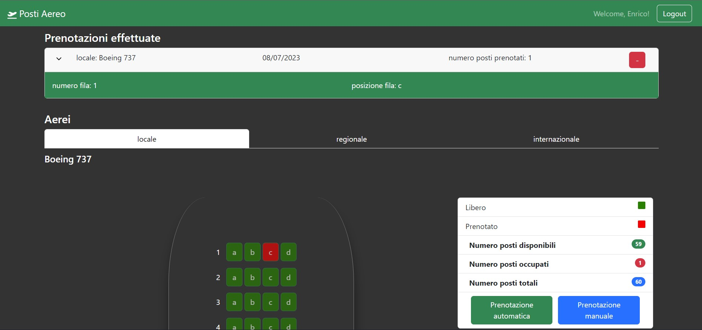

#"Posti aereo"
## Karakaci Redon 

## React Client Application Routes

- Route `/`: pagina principale, mostra i 3 aerei selezionabili quando si arriva sul sito
- Route `/login`: pagina per fare il login
- Rroute `*`: per le pagine che non esistono

## API Server

### Autenticazione

### __Crea una nuova sessione (login)__

URL: `/api/sessions`

HTTP Method: POST

Description: crea una nuova sessione utilizzando le credenziali.

Request body:
```
{
  "username": "luigi@test.com",
  "password": "pwd"
}
```

Response: `200 OK` (successo) o `500 Internal Server Error` (errore generico).

Response body: _None_


#### __Restituisce la sessione corrente se questa esiste__

URL: `/api/sessions/current`

HTTP Method: GET

Descrizione: Verifica se la sessione data è ancora valida e restituisci le informazioni sull'utente che ha effettuato l'accesso. Deve essere fornito un cookie con un ID DI SESSIONE VALIDA per ottenere le informazioni dell'utente autenticato nella sessione corrente.

Request body: _None_ 

Response: `201 Created` (successo) or `401 Unauthorized` (errore).

Response body:
```
{
  "username": "luigi@test.com",
  "id": 4,
  "name": "luigi"
}
```

#### __Elimina la sessione corrente (logout)__

URL: `/api/sessions/current`

HTTP Method: DELETE

Description: Elimina la sessione corrente. Deve essere fornito un cookie con un ID DI SESSIONE VALIDA.

Request body: _None_

Response: `200 OK` (successo) or `500 Internal Server Error` (errore generico).

Response body: _None_

## API senza autenticazione

### __Restituisce le informazioni generali degli aerei__

URL: `/api/aerei`

Method: GET

Description: restituisce le informazioni riguardanti l'id e il nome di ogni aereo.

Request body: _None_

Response: `200 OK` (successo) or `500 Internal Server Error` (errore generico).

Response body: un array di oggetti contententi le informazioni di "id" e "tipo" degli aerei.
```
[
  {
    "idAereo": 1,
    "tipoAereo": "locale"
  },
  {
    "idAereo": 2,
    "tipoAereo": "regionale"
  },
  {
    "idAereo": 3,
    "tipoAereo": "internazionale"
  }
]
```

### __Restituisce tutte le informazioni dell'aereo con l'id specificato__

URL: `/api/aerei/<id>`

Method: GET

Description: restituisce tutte le informazioni dell'aereo identificato dall' `<id>`.

Request body: _None_

Response: `200 OK` (successo), `404 Not Found` (id errato), or `500 Internal Server Error` (errore generico).

Response body: un oggetto corrispondente all'aereo richiesto.
```
{
  "aereoId": 2,
  "tipoAereo": "regionale",
  "numFile": 20,
  "postiPerFila": 5,
  "modello": "Boeing 777",
  "posti": [
    {
      "postoId": 61,
      "numFila": 1,
      "posFila": "a",
      "idPrenotazione": null
    },
    {
      "postoId": 62,
      "numFila": 1,
      "posFila": "b",
      "idPrenotazione": null
    },
    ...
  ]
}
```

## API con autenticazione

### __Restituisce le informazioni generali delle prenotazioni relative all'utente loggato__

URL: `/api/prenotazioni`

Method: GET

Description: restituisce tutte le informazioni delle prenotazioni di quell'utente.

Request body: _None_

Response: `200 OK` (successo), `500 Internal Server Error` (errore generico), Se la richiesta non arriva su una sessione autenticata, `401 Unauthorized`

Response body: un array di oggetti, ogni oggetto rappresenta una prenotazione.
```
[
  {
    "idPrenotazione": 198,
    "tipoAereo": "regionale",
    "modelloAereo": "Boeing 777",
    "dataPrenotazione": "2023-07-07",
    "posti": [
      {
        "idPosto": 61,
        "numeroFila": 1,
        "posizioneFila": "a"
      },
      {
        "idPosto": 62,
        "numeroFila": 1,
        "posizioneFila": "b"
      }
    ]
  }
]
```

### __Elimina una prenotazione__

URL: `/api/prenotazioni/<id>`

Method: DELETE

Description: elimina una prenotazione esistente, identificata dal suo id. Deve essere fornito un cookie con una SESSION ID valida. L'utente che richiede la cancellazione della prenotazione deve essere lo stesso proprietario della prenotazione. 

Request body: _None_

Response: `204 No Content` (successo) or `503 Service Unavailable` (errore generico). Se la richiesta non arriva su una sessione autenticata, `401 Unauthorized`.

Response body: _None_


### __Inserisce una nuova prenotazione__

URL: `/api/prenotazioni`

Method: POST

Description: aggiunge una nuova prenotazione relativa a un certo aereo. Deve essere fornito un cookie con una SESSION ID valida. L'utente che aggiunge la risposta viene preso dalla sessione.

Request body: un oggetto contenente la prenotazione (Content-Type: `application/json`).
```
{
    "posti": [
      {
        row: 1,
        seat: "a"
      }
      {
        row: 1,
        seat: "b"
      }
      {
        row: 1,
        seat: "c"
      }
    ],
    "idAereo": 3,
    "numeroPosti": 3,
}
```

Response: `201 Created` (success) o `503 Service Unavailable` (errore generico). se la richiesta non è valida, `422 Unprocessable Entity` (validation error). se l'id dell'aereo non esiste, `404 Not Found`. Se la richiesta non arriva su una sessione autenticata, `401 Unauthorized`.

Response body: l'Id della nuova prenotazione inserita 

## Database Tables

- Table `utenti` - contiene id nome email salt password
- Table `aerei` - contiene id nome numeroFile postiPerFIla 
- Table `posti` - contiene id aereoId prenotazioneId numeroFila posizioneFila
- Table `prenotazioni` - contiene id aereoId utenteId dataPrenotazione

## Main React Components

- `SeatMap` (in `Aereo.jsx`): è responsabile per la visualizzazione della mappa dei posti dell'aereo selezionato in un formato a griglia. Utilizza i dati dell'aereo passati come props per mostrare i posti disponibili, occupati e richiesti. Inoltre contiene la funzione randomPostiRichiesti e onSeatClick che gestiscono rispettivamente lo stato dei posti calcolati per la selezione automatica dei posti e quella dei posti richiesti per la selezione manuale
- `InfoAereo` (in `Aereo.jsx`): fornisce informazioni sull'aereo e sullo stato dei posti. Mostra il numero di posti disponibili, occupati e totali, oltre al numero di posti richiesti in caso di prenotazione manuale. Fornisce anche pulsanti per selezionare la modalità di prenotazione: automatica o manuale.
- `Prenotazioni` (in `Prenotazioni.jsx`): gestisce la visualizzazione delle prenotazioni effettuate. Utilizza lo stato interno prenotazioni per memorizzare le prenotazioni ottenute dal server. Ogni prenotazione viene rappresentata come una card con le informazioni dell'aereo, la data della prenotazione e il numero di posti prenotati. È presente anche un pulsante per eliminare la prenotazione. Quando viene selezionato il pulsante di espansione, vengono visualizzati i dettagli dei posti prenotati.
- `FormAutomatica` (in `FormPrenotazioni.jsx`): gestisce il form per la prenotazione automatica dei posti. Permette all'utente di inserire il numero di posti desiderati e invia la richiesta di prenotazione al server. Viene effettuata la validazione dei dati inseriti dall'utente, come ad esempio il controllo se il numero di posti è valido, non negativo e se ci sono abbastanza posti disponibili per la prenotazione. In caso di errori di validazione, viene visualizzato un messaggio di errore corrispondente. Se la prenotazione viene effettuata con successo, viene aggiornato lo stato globale dirty, mostrato un messaggio di successo e vengono resettati i campi del form.
- `FormManuale` (in `FormPrenotazioni.jsx`): gestisce il form per la prenotazione manuale dei posti. Richiede all'utente di selezionare manualmente i posti desiderati dalla mappa dei posti visualizzata a sinistra. Quando l'utente invia il form, viene effettuata la validazione dei dati inseriti e inviata la richiesta di prenotazione al server. Se la prenotazione viene effettuata con successo, viene aggiornato lo stato globale dirty, mostrato un messaggio di successo e vengono resettati i campi del form.

## Screenshot



## Users Credentials

- username: enrico@test.com, password: "pwd", utente con 2 prenotazioni
- username: luigi@test.com, password: "pwd", utente con 2 prenotazioni
- username: alice@test.com, password: "pwd"
- username: harry@test.com, password: "pwd"

